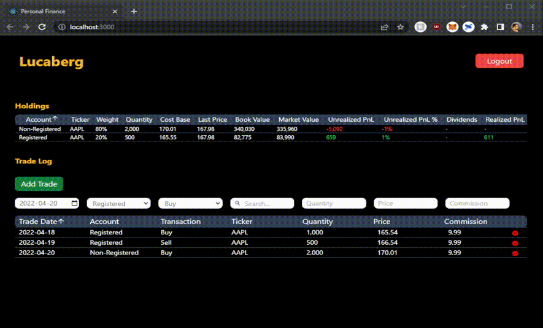
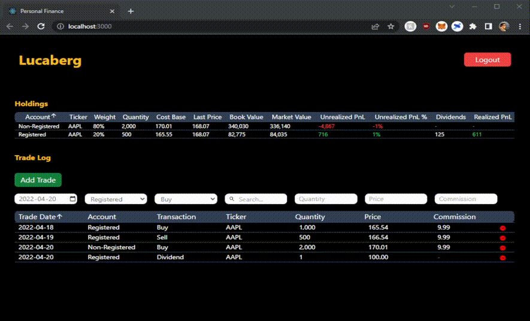
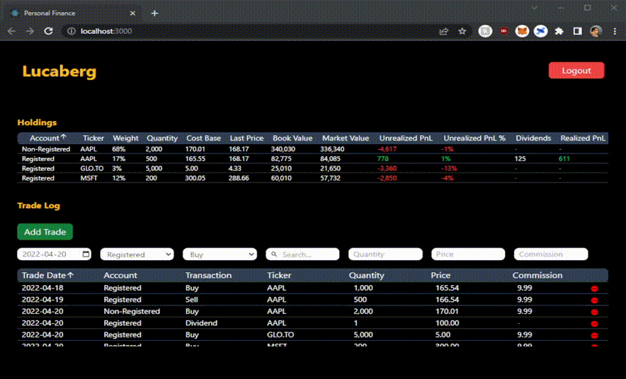

## Stock Porfolio App

Stock Porfolio App is a platform where users can register an account and input buy/sell/dividend transactions. The back-end compiles all transactions to build a portfolio of holdings. Metrics likes cost basis and performance are calculated.

## Technology Used

Full stack application split into 3 docker containers:

- Database: Postgres
- Sever: Python Flask
- Front-end: React.js

Dev and prod environments configured with seperate entrypoint.sh, dockerfiles, and databases ready to go.

- Dev: on startup entrypoint.sh clears, creates, and seeds a dev database.
- Prod: on startup entrypoint.prod.sh does not disrupt existing prod database. Prod uses NGINX to handle proxying.

Data sources:

- IEX API: financial data
- Yahoo Finance scraping: financial data

## GIF Demos

Users can add buy and sell transactions.

Users can add dividend transactions.

Dyanmic stock ticker search for all US and Canadian-listed securities.

Handling of multiple accounts, allowing users to track a seperate cost basis for each account.

Both the Holdings and Trade Log tables are sortable, making it easy for users to view data the way they like.

